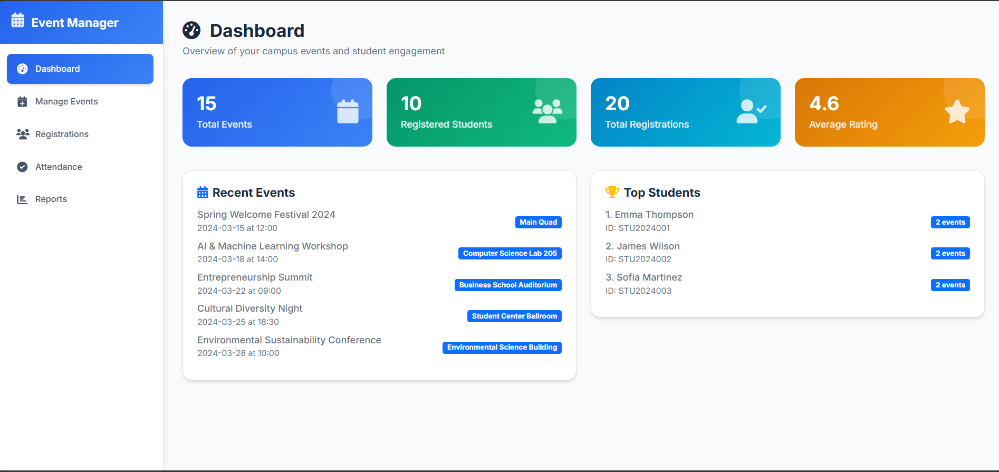

# Campus Event Manager

A full-stack app for managing university events. I was tired of seeing everything run on scattered spreadsheets and paper forms, so I built this to centralize everything.

## What's this all about?

Basically, it's a simple platform to stop the chaos around campus events. Admins get a dashboard to create and manage events, and students get a simple mobile-friendly view to see what's happening and sign up.

The whole thing is built with real-time updates in mind. So when a student checks in at an event, the admin's attendance list updates instantly without anyone having to hit refresh.

### The Admin Side
- Post new events and edit existing ones.
- See sign-ups roll in live.
- Use it as a digital check-in list during the event to track attendance.
- Pull simple reports to see which events were popular.

### The Student App
- A clean list of all upcoming events.
- Register for stuff with a single tap.
- A simple "Check-in" button for when you get to the event.
- Can leave a rating or feedback after.
- Basic profile management.

## Tech Choices

Honestly, I wanted a solid project to use **Node.js/Express** for, and they're just fast and easy to get going with. I went with **SQLite** for the database because I didn't want the headache of setting up a whole separate DB server for a project of this scale.

The real-time stuff is handled by **Socket.IO**. For the frontend, I kept it simple with **vanilla JS** and styled everything with **Tailwind CSS** to keep it looking clean without a heavy framework.

## Getting it Running

**What you'll need:**
- Node.js (v14 or newer)
- npm

**Installation:**

1.  First, clone or download the repo.
2.  `cd` into the project folder.
3.  Install all the packages:
    ```bash
    npm install
    ```
4.  The project includes a script to set up the database and fill it with some sample data so you can see how it works right away. Run:
    ```bash
    node scripts/populate-database-corrected.js
    ```
5.  Start it up!
    ```bash
    npm start
    ```
6.  Now you can open it in your browser:
    -   Admin View: `http://localhost:3000/admin`
    -   Student View: `http://localhost:3000/mobile`

## Playing Around

To make testing easier, I've pre-loaded the database with a bunch of sample events and students. You can log in as a student using their ID and full name.

**Try these test logins:**
-   **ID:** `STU2024001`, **Name:** `Emma Thompson`
-   **ID:** `STU2024002`, **Name:** `James Wilson`
-   **ID:** `STU2024003`, **Name:** `Sofia Martinez`

## Screenshots

Here's a quick look at the admin portal and the responsive student app.

### Admin Portal

*A peek at the admin dashboard with event overview.*

### Student App (Responsive Design)
The student portal is fully responsive and works on both desktop and mobile browsers.

#### Desktop Browser View

*The main event listing for students on a desktop browser.*

*Detailed view of a specific event.*

*Confirmation after registering for an event.*

#### Mobile App View

*Browsing available events on the mobile app.*

*Viewing registered and attended events in the "My Events" section.*

*Submitting feedback after an event.*

## If it breaks... (Troubleshooting)

-   **"Port already in use" error?** Something else is running on port 3000. You can either find and kill that process or just change the port number at the bottom of `server.js`.
-   **Student login not working?** Make sure you're typing the ID and the full name exactly as they are in the sample data list.
-   **Database is acting weird?** Just delete the `database.sqlite` file and run the `populate-database-corrected.js` script again to start fresh.
-   **CORS issues?** The CORS thing gave me a bit of trouble at first. This is usually because the API call isn't pointing to the right place. Double-check that the server is running and the endpoints in the JS files are correct.

## Future Ideas / Wishlist

This was built for a specific purpose, but there's a lot more that could be added.
-   Real user accounts with passwords.
-   Email reminders for registered events.
-   A calendar view.
-   A waitlist system for full events.
-   The big one: a QR code check-in system would be really cool.

## License

This was an educational project for me. Feel free to clone it, break it, and learn from it. No restrictions.
